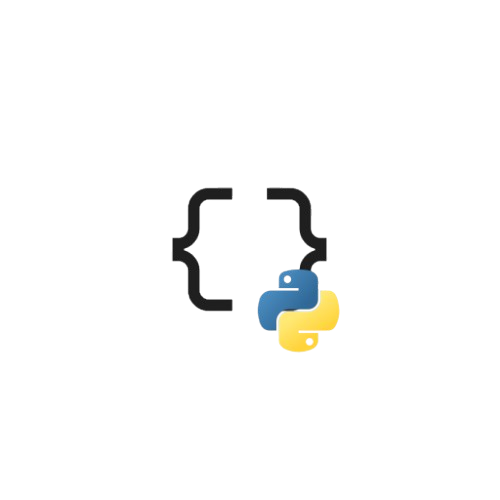

# SerdeJSONPy




A **high-performance**, **feature-packed** Rust library exposed to Python using **PyO3** for **JSON manipulation**.
SerdeJSONPy gives you **full control over JSON objects**, from simple parsing to advanced structural operations.

---

## ✨ Features

* Parse JSON strings/bytes to Python objects
* Serialize Python objects to JSON (compact & pretty)
* Getter & setter for deeply nested keys
* Path access & JSON Pointer (RFC 6901)
* Type checks (`is_null`, `is_array`, `is_object`, etc.)
* Safe value extraction (`as_i64`, `as_str`, `as_bool`, etc.)
* Flatten deeply nested JSON
* Recursive key & value retrieval
* Count total values in a structure
* Find all paths to a specific value
* Remove null values recursively
* Sort keys alphabetically
* Compute nesting depth
* Validate JSON strings
* Minify JSON
* Deep merge JSON objects
* Structural equality comparison
* Compute size in bytes
* Optional `PyJson` wrapper

---

## 🚀 Installation

```bash
pip install serdejsonpy
```

Requires **Rust 1.74+** and **PyO3**. For local builds, use `maturin`.

---

## 🐍 Usage Example

```python
from typing import Any
from serdejsonpy import SerdeJSON

sj = SerdeJSON()

sample_json = {
    "name": "Alice",
    "age": 30,
    "active": True,
    "skills": ["Python", "Rust", None],
    "details": {"height": 165.5, "weight": None},
    "flags": {"flag1": True, "flag2": False, "flag3": "yes", "flag4": 1},
    "empty": None
}

def section(title: str):
    print("\n" + "=" * 60)
    print(title)
    print("=" * 60)

def show(label: str, value: Any):
    print(f"\n{label}:")
    if isinstance(value, (dict, list)):
        print(sj.to_json_pretty(value))
    else:
        print(value)

section("SERIALIZATION")
show("to_json", sj.to_json(sample_json))
show("to_json_pretty", sj.to_json_pretty(sample_json))
show("to_bytes", sj.to_bytes(sample_json))
show("to_bytes_pretty", sj.to_bytes_pretty(sample_json))

section("DESERIALIZATION")
json_str = sj.to_json(sample_json)
show("from_json", sj.from_json(json_str))
show("from_bytes", sj.from_bytes(sj.to_bytes(sample_json)))

section("TYPE CHECKS")
show("is_null(empty)", sj.is_null(sample_json["empty"]))
show("is_boolean(active)", sj.is_boolean(sample_json["active"]))
show("is_number(age)", sj.is_number(sample_json["age"]))
show("is_string(name)", sj.is_string(sample_json["name"]))
show("is_array(skills)", sj.is_array(sample_json["skills"]))
show("is_object(details)", sj.is_object(sample_json["details"]))

section("VALUE EXTRACTION")
show("as_bool(active)", sj.as_bool(sample_json["active"]))
show("as_i64(age)", sj.as_i64(sample_json["age"]))
show("as_f64(height)", sj.as_f64(sample_json["details"]["height"]))
show("as_str(name)", sj.as_str(sample_json["name"]))

section("MERGE AND MUTATION")
extra_json = {"new_field": 123, "active": False}
show("merge", sj.merge(sample_json, extra_json))
show("get(name)", sj.get(sample_json, "name"))
show("set(name = Bob)", sj.set(sample_json, "name", "Bob"))

section("PATH AND POINTER")
show("get_path(details.height)", sj.get_path(sample_json, ["details", "height"]))
show("pointer(/details/weight)", sj.pointer(sample_json, "/details/weight"))

section("STRUCTURAL OPS")
show("flatten", sj.flatten(sample_json))
show("keys", sj.keys(sample_json))
show("values", sj.values(sample_json))
show("count_values", sj.count_values(sample_json))

section("ADVANCED OPS")
show("find_paths(None)", sj.find_paths(sample_json, None))
show("remove_nulls", sj.remove_nulls(sample_json))
show("sort_keys", sj.sort_keys(sample_json))
show("depth", sj.depth(sample_json))

section("VALIDATION AND UTILS")
show("validate", sj.validate(json_str))
show("minify", sj.minify(json_str))
show("equals(self, self)", sj.equals(sample_json, sample_json))
show("size", sj.size(sample_json))

print("DONE. ALL METHODS EXECUTED SUCCESSFULLY.")
```

A colorful example using `rich` panels is available in `examples/example.py`.

---

## 🛠️ Build from Source

```bash
pip install maturin
./build.ps1
```

---

## 📦 PyJson Wrapper (Optional)

```python
from serdejsonpy import PyJson

j = PyJson({"name": "Alice", "age": 30})
print(j.to_py())
j.set("age", 25)
print(j.to_py())
print(j.to_bytes())
```

Provides a clean, Pythonic wrapper over the Rust-backed engine.

---

## 🌈 Why SerdeJSONPy?

* **Blazing fast** — Rust-powered core
* **Full control** — from basic get/set to deep structural ops
* **Python-native** — seamless conversion to/from Python objects
* **Production-ready** — safe, validated, and battle-tested

---

## 📜 License

MIT License

---

## 🔗 Links

* GitHub: [https://github.com/pro-grammer-SD/serdejsonpy](https://github.com/pro-grammer-SD/serdejsonpy)
* Serde Docs: [https://docs.rs/serde/](https://docs.rs/serde/)

---

Made with 💜 by **Soumalya**
